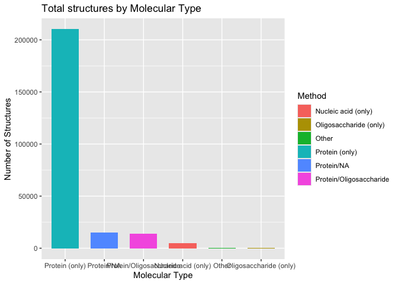
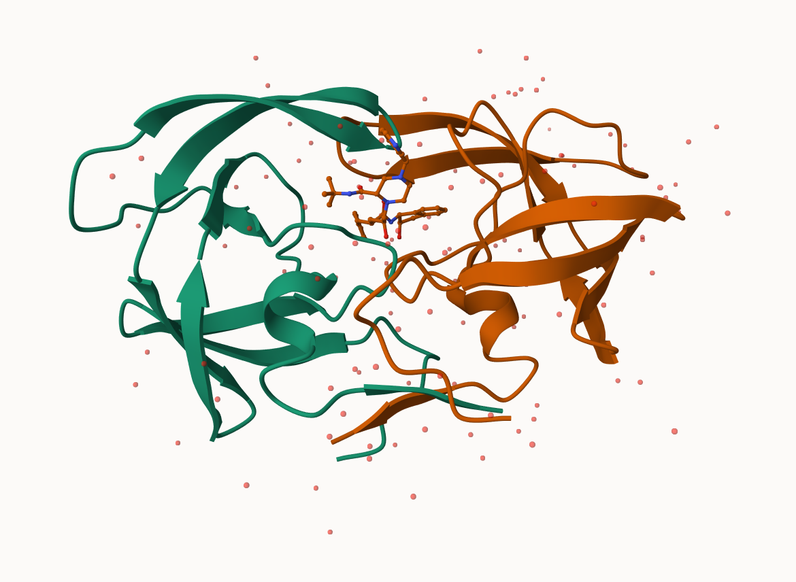

# Class 09
Elsa Quillin (PID: A69043008)

## The PDB database

``` r
library(readr)
```

    Warning: package 'readr' was built under R version 4.5.2

``` r
stats <- read_csv("Data Export Summary.csv")
```

    Rows: 6 Columns: 9
    ── Column specification ────────────────────────────────────────────────────────
    Delimiter: ","
    chr (1): Molecular Type
    dbl (4): Integrative, Multiple methods, Neutron, Other
    num (4): X-ray, EM, NMR, Total

    ℹ Use `spec()` to retrieve the full column specification for this data.
    ℹ Specify the column types or set `show_col_types = FALSE` to quiet this message.

``` r
stats
```

    # A tibble: 6 × 9
      `Molecular Type`    `X-ray`    EM   NMR Integrative `Multiple methods` Neutron
      <chr>                 <dbl> <dbl> <dbl>       <dbl>              <dbl>   <dbl>
    1 Protein (only)       176378 20438 12709         342                221      83
    2 Protein/Oligosacch…   10284  3396    34           8                 11       1
    3 Protein/NA             9007  5931   287          24                  7       0
    4 Nucleic acid (only)    3077   200  1554           2                 15       3
    5 Other                   174    13    33           3                  0       0
    6 Oligosaccharide (o…      11     0     6           0                  1       0
    # ℹ 2 more variables: Other <dbl>, Total <dbl>

> Q1: What percentage of structures in the PDB are solved by X-Ray and
> Electron Microscopy.

``` r
Xray <- sum( stats$`X-ray`)
EM <- sum(stats$EM)
Total <- sum( stats$Total)

(Xray/Total)*100
```

    [1] 81.43231

``` r
(EM/Total)*100
```

    [1] 12.27148

``` r
((Xray+EM)/Total)*100
```

    [1] 93.70379

> Q2: What proportion of structures in the PDB are protein?

``` r
protein <- sum(stats[1, 2:(ncol(stats) - 1)])

protein/Total
```

    [1] 0.860465

> Make a bar plot overview.

``` r
library(ggplot2)
```

    Warning: package 'ggplot2' was built under R version 4.5.2

``` r
ggplot(stats) + 
  aes(x = reorder(`Molecular Type`, -Total), y = Total, fill = `Molecular Type`) + 
  geom_col(width = 0.7) +
  labs(
    title = "Total structures by Molecular Type",
    x = "Molecular Type",
    y = "Number of Structures",
    fill = "Method")
```



> Q3: Type HIV in the PDB website search box on the home page and
> determine how many HIV-1 protease structures are in the current PDB?

There are currently 2,406 hits for HIV-1 protease structures

## Visualizing structure data

The Mol\* viewer is embedded in many bioinformatics website. The
homepage is https://molstar.org/

I can insert any figure or image file using markadown format


