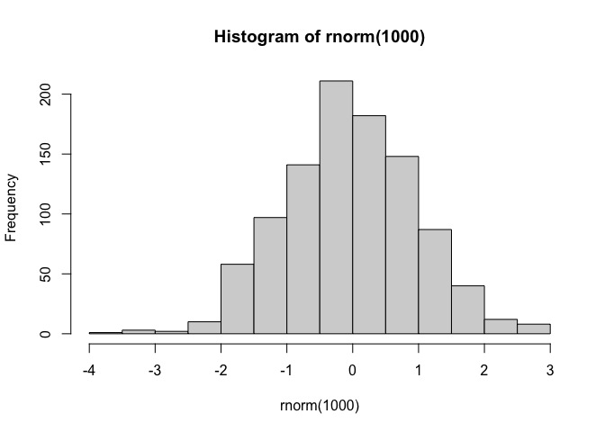
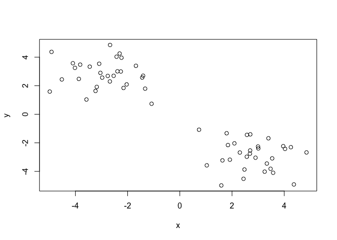
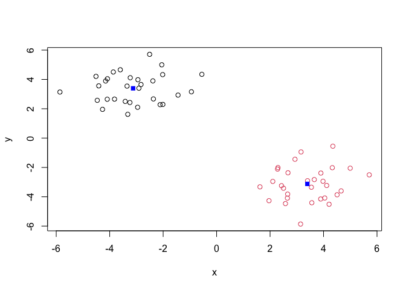
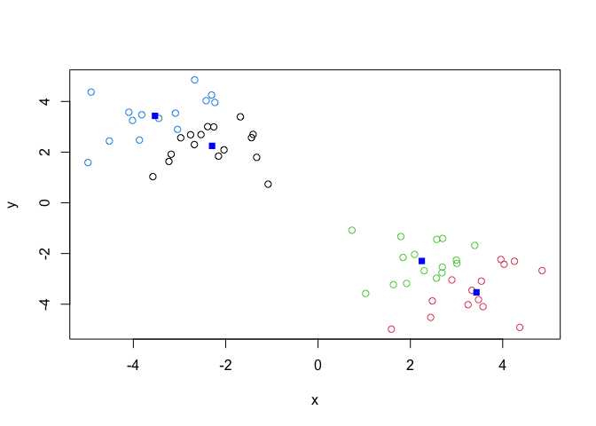
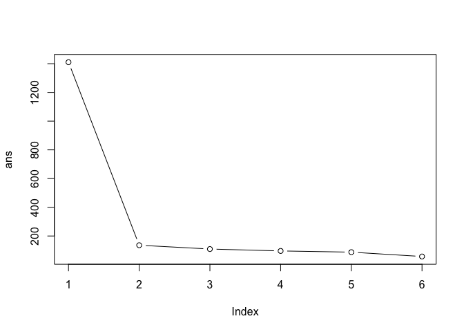
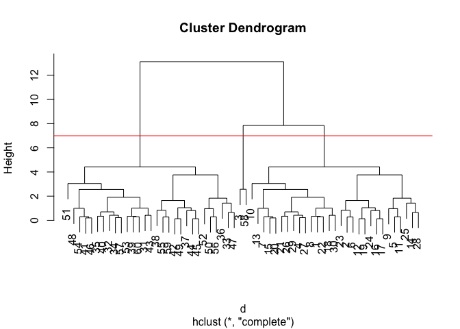
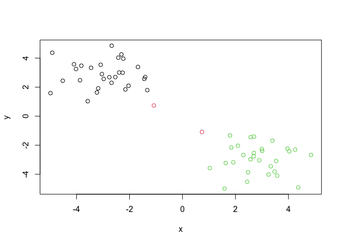

# Class 7: Machine Learning 1
Elsa Quillin (A69043008)

Today we will begin our exploration of some “classical” machine learning
approaches. We will start with clustering:

Let’s first make up some data to cluster where we know what the answer
should be.

``` r
hist( rnorm(1000) )
```



``` r
x<- c(rnorm(30, mean=-3), rnorm(30, mean=3))
y<- rev(x)

x<- cbind(x, y)
head(x)
```

                  x        y
    [1,] -3.6027042 4.658262
    [2,] -3.2309302 4.117067
    [3,] -1.4430143 2.931308
    [4,] -2.1123345 2.279581
    [5,] -0.5525517 4.348254
    [6,] -3.3238540 1.621448

A wee peak at x with `plot()`

``` r
plot(x)
```



The main function in “base” R for K-means clustering is called
`kmeans()`.

``` r
k<- kmeans(x, centers=2)
k
```

    K-means clustering with 2 clusters of sizes 30, 30

    Cluster means:
              x         y
    1 -3.123806  3.394044
    2  3.394044 -3.123806

    Clustering vector:
     [1] 1 1 1 1 1 1 1 1 1 1 1 1 1 1 1 1 1 1 1 1 1 1 1 1 1 1 1 1 1 1 2 2 2 2 2 2 2 2
    [39] 2 2 2 2 2 2 2 2 2 2 2 2 2 2 2 2 2 2 2 2 2 2

    Within cluster sum of squares by cluster:
    [1] 67.88577 67.88577
     (between_SS / total_SS =  90.4 %)

    Available components:

    [1] "cluster"      "centers"      "totss"        "withinss"     "tot.withinss"
    [6] "betweenss"    "size"         "iter"         "ifault"      

> Q. How big are the clusters (i.e. their size)?

``` r
k$size
```

    [1] 30 30

> Q. What clusters do my data points reside in?

``` r
k$cluster
```

     [1] 1 1 1 1 1 1 1 1 1 1 1 1 1 1 1 1 1 1 1 1 1 1 1 1 1 1 1 1 1 1 2 2 2 2 2 2 2 2
    [39] 2 2 2 2 2 2 2 2 2 2 2 2 2 2 2 2 2 2 2 2 2 2

> Q. Make a plot of our data colored by cluster assignment- i.e. Make a
> result figure…

``` r
plot(x, col=k$cluster)
points(k$centers, col="blue", pch=15)
```



> Q. Cluster with k-means into 4 clusters and plot your results as above

``` r
k4<- kmeans(x, centers=4)
plot(x, col=k4$cluster)
points(k4$centers, col="blue", pch=15)
```



> Q. Run k-means with centers (i.e.values of k) equal 1 to 6.
> tot.withinss

``` r
ans <- NULL
for(i in 1:6){
  ans<- c(ans, kmeans(x, centers=i)$tot.withinss)
}
ans
```

    [1] 1410.24267  135.77154  109.17083   95.91579   87.43152   57.20482

Make a “scree-plot”

``` r
plot(ans, typ="b")
```



## Hierarchical Clustering

The main function in “base” R for this is called `hclust()`

``` r
d<- dist(x)
hc<- hclust(d)
plot(hc)
abline(h=7, col="red")
```



To obtain clusters from our `hclust()` result object **hc** we “cut” the
tree to yield different sub branches. For this we use the `cutree()`
function

``` r
grps<- cutree(hc, h=7)
grps
```

     [1] 1 1 1 1 1 1 1 1 1 1 1 1 1 1 1 1 1 1 1 1 1 1 1 1 1 1 1 1 1 1 2 2 2 2 2 2 2 2
    [39] 2 2 2 2 2 2 2 2 2 2 2 2 2 2 2 2 2 2 2 2 2 2

Results figure

``` r
plot(x, col=grps)
```



## Principal Component Analysis

``` r
url <- "https://tinyurl.com/UK-foods"
x <- read.csv(url)
```

> Q1. How many rows and columns are in your new data frame named x? What
> R functions could you use to answer this questions?

``` r
dim(x)
```

    [1] 17  5

``` r
rownames(x) <- x[,1]
x <- x[,-1]
head(x)
```

                   England Wales Scotland N.Ireland
    Cheese             105   103      103        66
    Carcass_meat       245   227      242       267
    Other_meat         685   803      750       586
    Fish               147   160      122        93
    Fats_and_oils      193   235      184       209
    Sugars             156   175      147       139

``` r
dim(x)
```

    [1] 17  4

> Q2. Which approach to solving the ‘row-names problem’ mentioned above
> do you prefer and why? Is one approach more robust than another under
> certain circumstances?

I like the second approach (row.names=1) more since I feel like there is
less room for error.

``` r
barplot(as.matrix(x), beside=T, col=rainbow(nrow(x)))
```


> Q3: Changing what optional argument in the above barplot() function
> results in the following plot?

You could change the “beside” argument to false, as shown below

``` r
barplot(as.matrix(x), beside=FALSE, col=rainbow(nrow(x)))
```


``` r
library(tidyr)

x_long <- x |> 
          tibble::rownames_to_column("Food") |> 
          pivot_longer(cols = -Food, 
                       names_to = "Country", 
                       values_to = "Consumption")

dim(x_long)
```

    [1] 68  3

``` r
library(ggplot2)
```

    Warning: package 'ggplot2' was built under R version 4.5.2

``` r
ggplot(x_long) +
  aes(x = Country, y = Consumption, fill = Food) +
  geom_col(position = "dodge") +
  theme_bw()
```


> Q4: Changing what optional argument in the above ggplot() code results
> in a stacked barplot figure?

You can change the geom_col argument from dodge to stack

``` r
library(ggplot2)

ggplot(x_long) +
  aes(x = Country, y = Consumption, fill = Food) +
  geom_col(position = "stack") +
  theme_bw()
```


> Q5: We can use the pairs() function to generate all pairwise plots for
> our countries. Can you make sense of the following code and resulting
> figure? What does it mean if a given point lies on the diagonal for a
> given plot?

A given point being on the line shows it’s relationship between the two
countries it is related to. For example the pink dot in the plot below
England means it’s high in England and also high in Wales.

``` r
pairs(x, col=rainbow(nrow(x)), pch=16)
```


``` r
library(pheatmap)

pheatmap( as.matrix(x) )
```


> Q6. Based on the pairs and heatmap figures, which countries cluster
> together and what does this suggest about their food consumption
> patterns? Can you easily tell what the main differences between N.
> Ireland and the other countries of the UK in terms of this data-set?

England and Wales cluster together the most, indicating they have more
similar food consumption patterns. After that Scotland, England, and
Wales are clustered, meaning Ireland has the most different food
consumption patterns.

``` r
pca <- prcomp( t(x) )
summary(pca)
```

    Importance of components:
                                PC1      PC2      PC3       PC4
    Standard deviation     324.1502 212.7478 73.87622 2.921e-14
    Proportion of Variance   0.6744   0.2905  0.03503 0.000e+00
    Cumulative Proportion    0.6744   0.9650  1.00000 1.000e+00

> Q7. Complete the code below to generate a plot of PC1 vs PC2. The
> second line adds text labels over the data points.

``` r
df <- as.data.frame(pca$x)
df$Country <- rownames(df)

ggplot(pca$x) +
  aes(x = PC1, y = PC2, label = rownames(pca$x)) +
  geom_point(size = 3) +
  geom_text(vjust = -0.5) +
  xlim(-270, 500) +
  xlab("PC1") +
  ylab("PC2") +
  theme_bw()
```


> Q8. Customize your plot so that the colors of the country names match
> the colors in our UK and Ireland map and table at start of this
> document.

``` r
df <- as.data.frame(pca$x)
df$Country <- rownames(df)

cols <- c("orange", "red", "blue", "darkgreen")

ggplot(df, aes(x = PC1, y = PC2, label = Country, color = Country)) +
  geom_point(size = 3) +
  geom_text(vjust = -0.5) +
  xlim(-270, 500) +
  xlab("PC1") +
  ylab("PC2") +
  scale_color_manual(values = cols) +
  theme_bw()
```


``` r
v <- round( pca$sdev^2/sum(pca$sdev^2) * 100 )
v
```

    [1] 67 29  4  0

``` r
z <- summary(pca)
z$importance
```

                                 PC1       PC2      PC3          PC4
    Standard deviation     324.15019 212.74780 73.87622 2.921348e-14
    Proportion of Variance   0.67444   0.29052  0.03503 0.000000e+00
    Cumulative Proportion    0.67444   0.96497  1.00000 1.000000e+00

``` r
# Create scree plot with ggplot
variance_df <- data.frame(
  PC = factor(paste0("PC", 1:length(v)), levels = paste0("PC", 1:length(v))),
  Variance = v
)

ggplot(variance_df) +
  aes(x = PC, y = Variance) +
  geom_col(fill = "steelblue") +
  xlab("Principal Component") +
  ylab("Percent Variation") +
  theme_bw() +
  theme(axis.text.x = element_text(angle = 0))
```


``` r
ggplot(pca$rotation) +
  aes(x = PC1, 
      y = reorder(rownames(pca$rotation), PC1)) +
  geom_col(fill = "steelblue") +
  xlab("PC1 Loading Score") +
  ylab("") +
  theme_bw() +
  theme(axis.text.y = element_text(size = 9))
```


> Q9: Generate a similar ‘loadings plot’ for PC2. What two food groups
> feature prominantely and what does PC2 maninly tell us about?

The two food groups that are featured predominantly are soft drinks and
fresh potatoes.

``` r
ggplot(pca$rotation) +
  aes(x = PC2, 
      y = reorder(rownames(pca$rotation), PC2)) +
  geom_col(fill = "steelblue") +
  xlab("PC2 Loading Score") +
  ylab("") +
  theme_bw() +
  theme(axis.text.y = element_text(size = 9))
```


